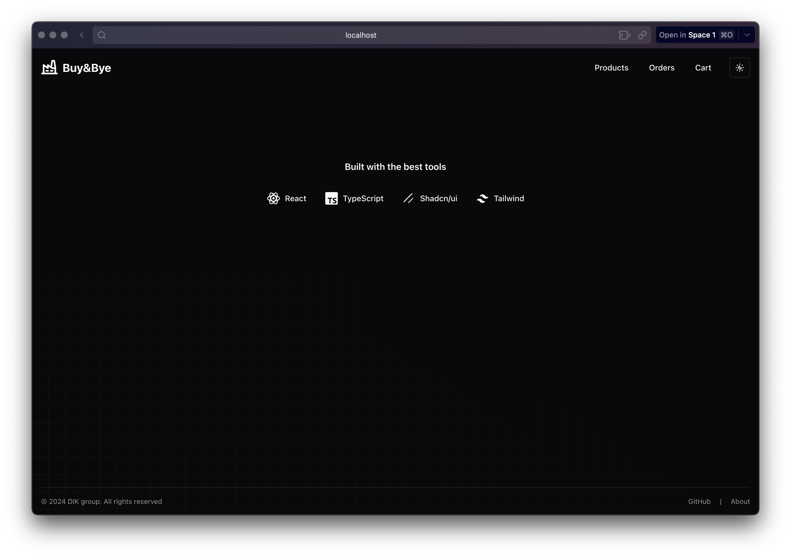
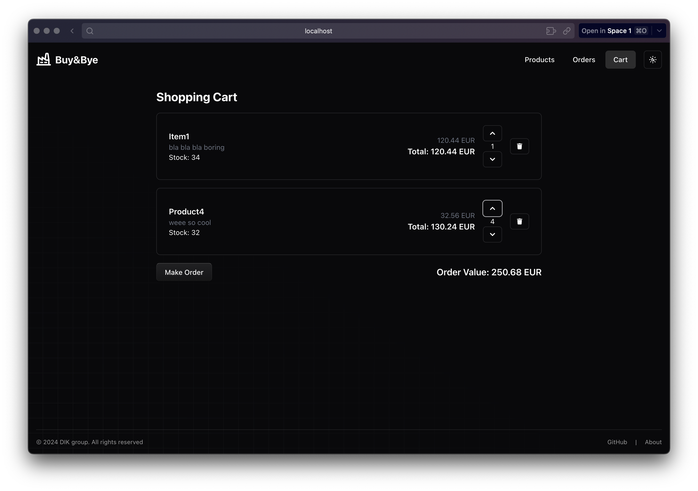
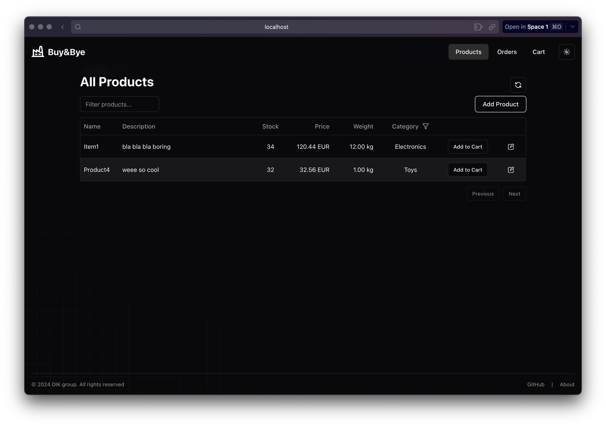
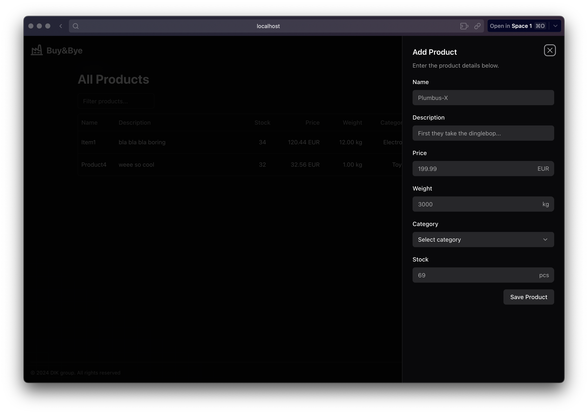
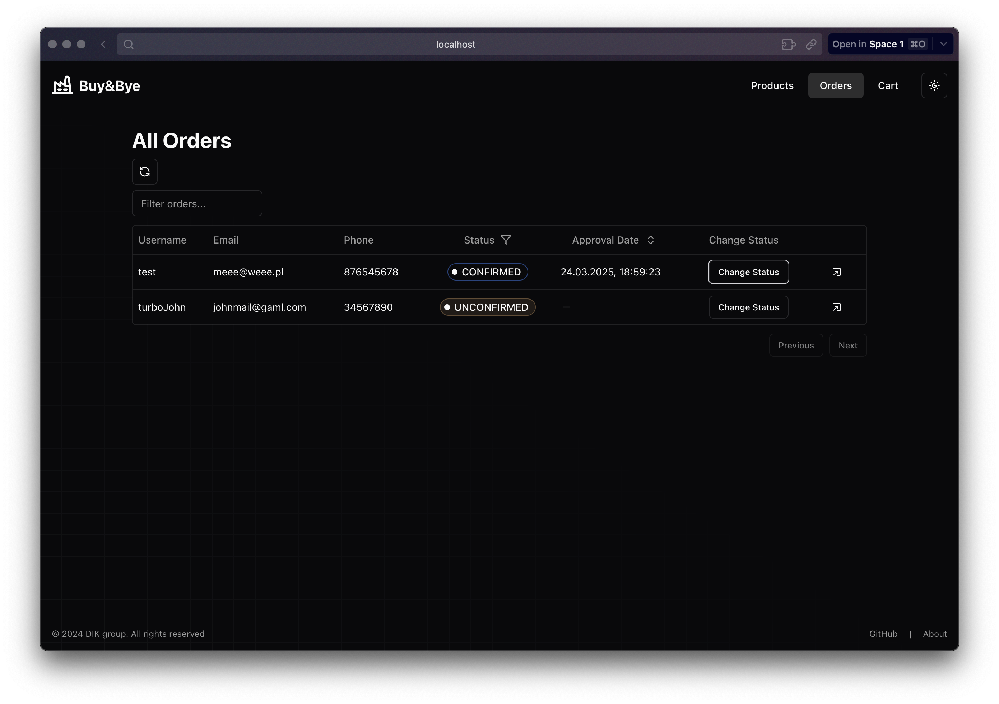
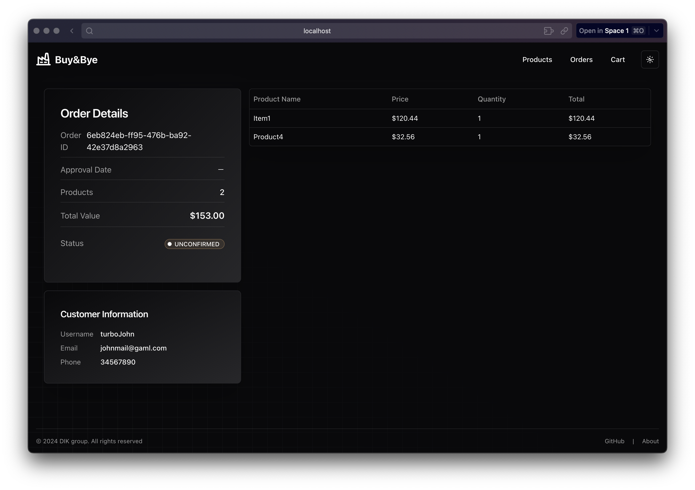

# 🖥️ Buy&Bye Frontend

This is the **frontend application** for the [Buy&Bye NestJS Backend](https://github.com/princeBugs33/BuyBye-NestJS-backend) — a simple CRUD-based store system for managing products, orders, and categories.

The frontend is developed using **Next.js**, styled with **Tailwind CSS**, and leverages **shadcn/ui** for modern, accessible UI components.

---

## 🚀 Tech Stack

- ⚡ **Next.js** – React framework for server-rendered apps
- 🎨 **Tailwind CSS** – Utility-first CSS framework
- 🧩 **shadcn/ui** – Headless and accessible component library
- 🔗 Connects to [Buy&Bye NestJS Backend](https://github.com/princeBugs33/BuyBye-NestJS-backend)

---

## 📦 Getting Started

### 1️⃣ Install dependencies

```bash
npm install
```

### 2️⃣ Start development server

```bash
npm run dev
```

The app will be available at `http://localhost:3001`

> Make sure your [Buy&Bye Backend](https://github.com/princeBugs33/BuyBye-NestJS-backend) is running and configured properly to allow API access from the frontend.

---

## 🖼️ Screenshots

### 🏠 Main View  


### 🛒 Cart  


### 📦 Products  


### ➕ Add Product  


### 📑 Orders  


### 📋 Order Details  


### 🧾 Make Order  

